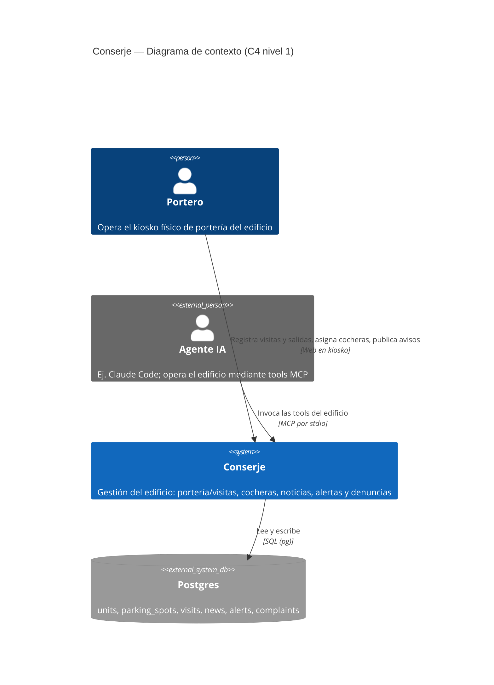

# C4 — Nivel 1: Contexto del sistema

Este diagrama muestra el sistema **Conserje** desde afuera: quiénes lo usan y de qué depende,
sin entrar en detalles internos. En el repo mantenemos solo los niveles 1 y 2 del modelo C4
porque son los que aportan a nivel de negocio y de onboarding; los niveles 3 y 4 (componentes
y código) cambian demasiado rápido y ya están documentados por el propio código y `CLAUDE.md`.

## Relaciones

- **Portero → Conserje**: usa la web app desde un kiosko físico en portería (una sola pantalla
  de uso interno, sin autenticación en el MVP).
- **Agente IA → Conserje**: un agente (por ejemplo Claude Code) opera el edificio a través del
  MCP server `consorcio-mcp`: registrar visitas y salidas, consultar el estado del parking,
  asignar cocheras.
- **Conserje → Postgres**: toda la información del edificio vive en una única base Postgres;
  tanto la web como el MCP terminan leyendo y escribiendo ahí, por lo que ambos ven la misma
  fuente de verdad (ver [nivel 2](./c4-nivel-2-contenedores.md)).
