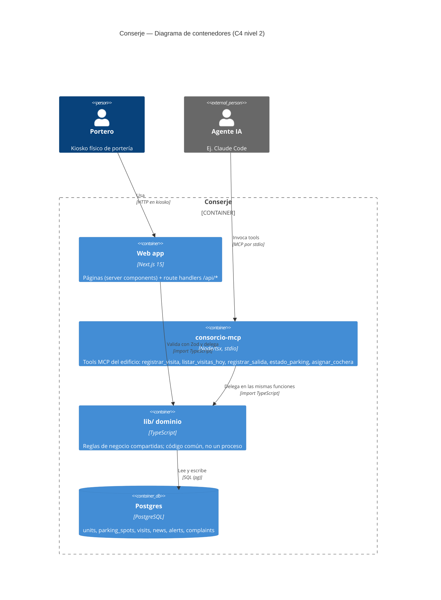

# C4 — Nivel 2: Contenedores

Este diagrama abre el sistema **Conserje** y muestra sus piezas desplegables y cómo se
comunican. Es el nivel más útil para el onboarding: deja a la vista que la web y el MCP son
dos clientes distintos de las mismas reglas de negocio y de la misma base de datos.

Una aclaración importante: `lib/` **no es un proceso separado**. Es código TypeScript
compartido que se ejecuta dentro del proceso de la web o dentro del proceso del MCP, según
quién lo importe. Lo representamos como contenedor lógico para hacer visible que **ambos
clientes pasan por las mismas reglas de dominio** (`DomainError`, validación, acceso a datos)
en lugar de duplicarlas.

## Relaciones

- **Portero → Web app**: la interfaz de portería (`/`, `/porteria`, `/parking`, `/noticias`,
  `/alertas`, `/denuncias`) corre en el kiosko. Los route handlers de `app/api/*` solo
  validan con Zod (`lib/schemas.ts`) y delegan.
- **Agente IA → consorcio-mcp**: el MCP server (`mcp/src/index.ts`) corre por stdio y expone
  la operación del edificio como tools.
- **Web app → lib/ dominio** y **consorcio-mcp → lib/ dominio**: ambos importan la misma
  lógica (`visits.ts`, `parking.ts`, `news.ts`, `alerts.ts`, `complaints.ts`). Los errores de
  negocio son `DomainError` (`invalid`/`not_found`/`conflict`), que la web mapea a
  400/404/409 vía `errorResponse` (`lib/api.ts`).
- **lib/ dominio → Postgres**: el dominio recibe una interfaz `DB` mínima (`{ query }`,
  `lib/db.ts`); en producción es el `Pool` de `pg` contra la `DATABASE_URL` compartida, y en
  tests es `pg-mem` con el mismo `schema.sql`. Web y MCP operan sobre la misma base: dos
  clientes, una única fuente de verdad.
