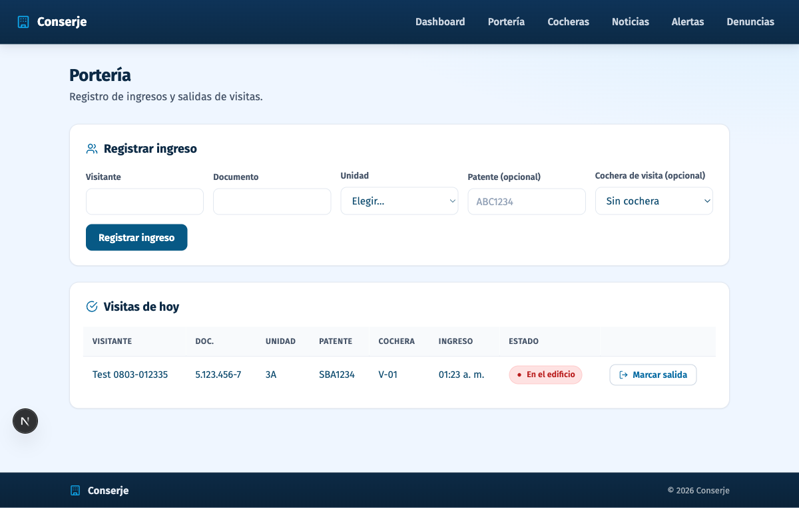
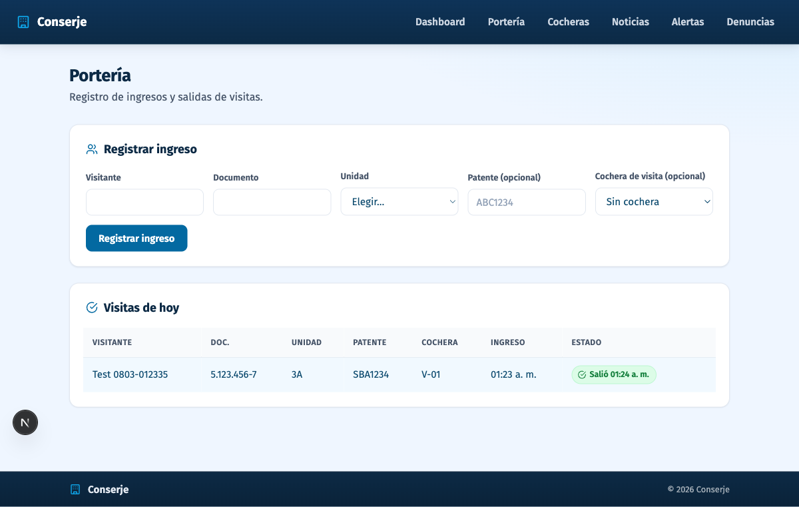
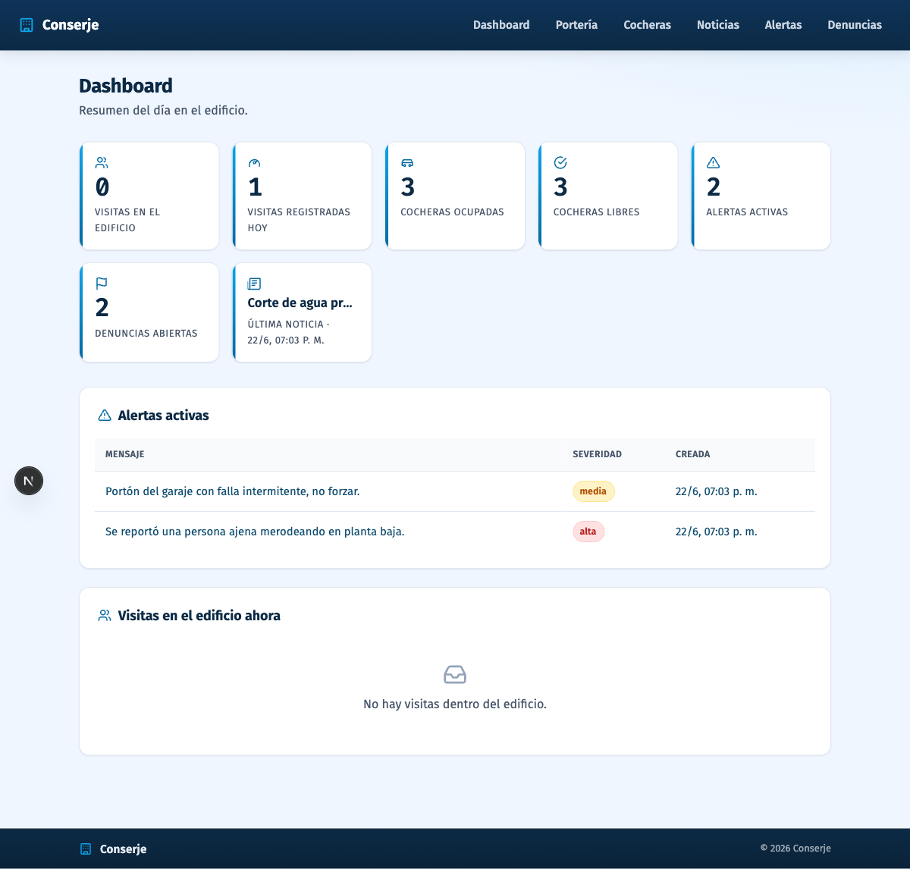

# Corrida — Browser agent sobre el flujo de portería

> Ejecución real del flujo definido en [`prompt-rccf.md`](./prompt-rccf.md), el 2026-08-03
> a la 01:23 (hora local), contra la app en `http://localhost:3000` (dev) con Postgres local.
> Herramienta: **MCP de Playwright** (el registrado en [`.mcp.json`](../../.mcp.json)).

## Pasos

```
PASO 1: navigate /porteria → 200; form "Registrar ingreso" visible, tabla vacía
        ("Todavía no hay visitas registradas hoy"), cocheras V-01/V-02/V-03 libres.
PASO 2: fill_form → Visitante "Test 0803-012335", Documento "5.123.456-7",
        Unidad "3A" (select), Patente "SBA1234", Cochera "V-01" (select).
PASO 3: click "Registrar ingreso".
PASO 4: wait_for "Visita registrada" → TIMEOUT 5s (el toast se auto-cierra antes del
        round-trip de la tool). FALLA MENOR, reintento con otra verificación.
PASO 5: snapshot → verificación por la tabla (más robusta que el toast):
        fila "Test 0803-012335 · 5.123.456-7 · 3A · SBA1234 · V-01 · 01:23" presente,
        con botón "Marcar salida". El form quedó reseteado y V-01 ya no aparece
        entre las cocheras libres (quedó ocupada). ✔
PASO 6: screenshot → capturas/01-visita-registrada.png
PASO 7: click "Marcar salida" en la fila del registro de prueba.
PASO 8: wait_for "Salió" → OK: el estado de la fila pasó a "Salió 01:24". ✔
PASO 9: screenshot → capturas/02-salida-marcada.png
PASO 10: navigate / (dashboard) → contadores coherentes con el movimiento:
         "Visitas registradas hoy: 1", "Visitas en el edificio: 0" (ya salió),
         y las tarjetas nuevas: "Denuncias abiertas: 2" y
         "Última noticia · Corte de agua programado". ✔
PASO 11: screenshot → capturas/03-dashboard-final.png; close.

VEREDICTO: flujo OK — registro, salida y reflejo en el dashboard verificados; 1 falla
menor (timeout del toast) resuelta verificando contra la tabla.
```

## Evidencia

| Momento | Captura |
| --- | --- |
| Visita registrada, en el edificio, V-01 ocupada |  |
| Salida marcada ("Salió 01:24") |  |
| Dashboard con los contadores y las tarjetas nuevas |  |

Costo de la corrida (tokens, tiempo, fallas): ver [`costo.md`](./costo.md).
